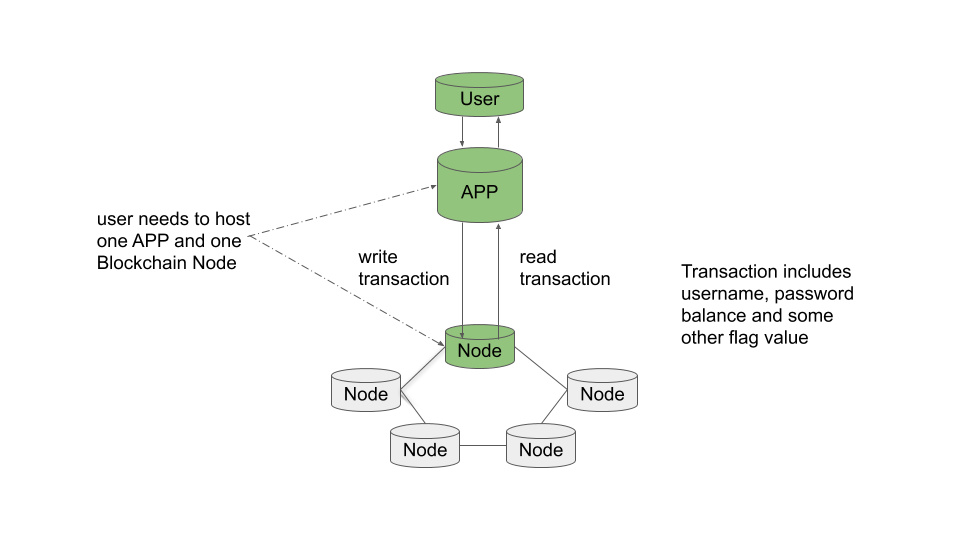

# cs686_BlockChain_P2_starter

## Finished

### 1. Transaction JSON format
#### 1.1 Transaction JSON format
{"password":"94d7e7ad5acafbd7082ade076b6c37e6","balance":10,"index":10,"isfinished":true}

- password: stores user's password's hash value
- balance: account current balance
- index: this is for this user's transaction index, when you logout from your account, index will increment. It helps us get the most updated transaction.
- isfinished: this is for indicate that you have finished from your last play period. When you logout, App will write a transaction with isfinished = true into blockchain. When you login, you get the most updated transaction, if the isfinished is false, it means that the last transaction is not finished, so we cannot start this transaction.

#### 1.2 mpt store format

- key: username
- value: transaction json

{
   "key":"{\"password\":\"94d7e7ad5acafbd7082ade076b6c37e6\",\"balance\":10,\"index\":10,\"isfinished\":true}"
}

#### 1.3 UnmarshalTx
This function will receive the JSON string of transaction, unmarshal it and return transaction struct.

#### 1.4 MarshalTx
This function will encode transaction struct to JSON string.

### 2. Develop Blockchain API

#### 2.1 DataQueue

This is like the transaction queue, all the transaction will immoderately store into this queue. When the node start making a new block, it will get all the transaction in this queue and then add them into mpt.

In this data structure, I add a transaction records map. When there is a duplicate transaction, it will not add into the queue. In this way, I want to reduce the duplicate block.

#### 2.2 WriteAPI 
*localhost:6686/writeApi/{hop}*

Receive JSON format for App. It implements hop in the REST API. For now, I did not use heartbeat because I don't want to make heartbeat more complicated. But maybe I will switch this function to heartbeat later.

writeApi will send POST request to write

*localhost:6686/write*

This is the place where the transactions write into data queue. Key is the username, value is the JSON string of transaction.

#### 2.3 Read
*localhost:6686/read/{key}*

Read will return the most updated Transaction, which has the highest index of transaction. If there are duplicate transaction of the same highest index, I only return one.

### 3. Account
#### 3.1 IfLogin
In my app, I use a flag value *IfLogin* to check if the user has already login, I set default value false, when you login successfully, it will reset to True. If user did not login and just buy lottery, it is not allowed. 

#### 3.1 Sign up
type *signup {password}*

User just provides password, username is auto-generated. This is because the blockchain does not write the data into the chain immediately, so when user sign up, the app cannot check the existed username and there can be two or more users used same username. In this case, I can prevent duplicate username in blockchain.

I use MD5 to make the username shorter. It hash the current Unix time.

At this time, when you sign up a new account, your balance will automatically be $10, for buying lottery.

If the sign up success, it will return username, otherwise it will show error.

#### 3.2 Login
type *login {username} {password}*

When you login, will use username as key to retrieve transaction in blockchain, then compare this password with user's provide password, and then it will check if the last transaction is finished, if not, it means that the user did not finish last time. 

When you login successfully, the app will store this retrieved transaction.

#### 3.3 Lucky
type *lucky {5 nums}*

This is the for generate the lottey numbers. For now, the app will generate 5 numbers range from 1 to 10.

Random function set the seed with username's hash value plus current Unix time. 

## Future

### 1. optimize login after sign in
For now, after sign up, we must wait the transaction write into blockchain. This needs more time, so maybe I can read from data queue to validate login later.

### 2. Redeem reward
Every time you type "lucky" to buy lottery, it will write transaction(isfinished = false). Before logout, all the transactions are all unfinished, this is because in case of someone close the app before logout. I will update the transaction struct to keep track of balance.

### 3. Logout
Actually I use transaction struct to record balance. When you logout, it will write a finish transaction to blockchain. So 
the transaction isFinished = true, index++, balance = current balance. So when you login next time, you can see the last transaction is finished, you can start new game.

## Reference 
https://hackernoon.com/today-i-learned-making-a-simple-interactive-shell-application-in-golang-aa83adcb266a

http://golangcookbook.blogspot.com/2012/11/generate-random-number-in-given-range.html
